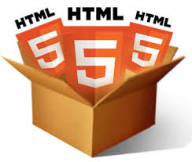
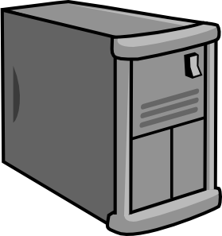
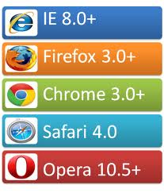

<!--

WARNING!! DON'T EDIT THE FILE README.md on the root of the project, that one is a GENERATED FILE!

You should just edit the source file at src/README.md - the one which stars with ## HTML5 JS APIs

-->

## HTML5 JS API - Part 2



Eduardo Silva @ [Avenue Code](http://www.avenuecode.com)

*esilva@avenuecode.com*

April 22nd, 2014

---

## Agenda

- Motivation
- LocalStorage/SessionStorage
- Limitations
- What's next?
- References
- Challenge

---

## Motivation 
 
 
 

---

## Motivation

- Cookies have been on scene for a while and are supported by almost all browsers
- It's a simple mechanism designed to store small key/value pairs locally
- Limited storage capability: 4KB for cookie
- They are sent over each HTTP request

---

## Motivation

- Typically use database to store data
- Solution designed for larger applications
- Data is available from any client machine

---

## Motivation

- Performance: Data can be accessed faster by reducing the amount load on the server
- Data can be retrieved with no login

---

## Web Storage API

- Part of the HTML5 specification
- http://dev.w3.org/html5/webstorage
- Stores data in key/value pairs

---

## Web Storage Flavours

- Session Storage
  - controls data for a single session in a single window

- Local Storage
  - controls data that is accessible over multiple windows and that persists for longer than a single session

- Storage space of around 5MB

---

## Web Storage - Getting started

- Key/value pairs

```javascript
"name" = "Jack"         
```


- Key/values are stored as String data types

```javascript
"author" = "true"
```

- You may need to use functions to convert data into a desired type

---

## Declaring Storage Objects

- Assigning Values

```javascript
<label>
  <input type="checkbox" onchange="sessionStorage.newsletter = true">
  I want to receive weekly news about Avenue Code
</label>
```

- Set Item Method

```javascript
  sessionStorage.setItem('newsletter', 'true');
```


---

## Web Storage Main Methods

- removeItem(key)
- length()
- key(n)
- getItem(key)
- clear()


---

## Web Storage Event

 - Event listeners can be registered to the window object
 - Events are fired when any change is make to the data
 - Events allow you to track:
    - Storage object: getStorageArea
    - key name: getKey
    - Previous value: getOldValue
    - New value: getNewValue
    - Trigger Page: getURL

---

## Web Storage - Current Support

- 

---

## Web Storage - Limitations

- QUOTA_EXCEEDED_ERR - Most of browsers give a limit of 5MB per origin that can be used as a space to store data locally. There is no programatically way to change it

- Saves only String data types. You may have a considerable overhead in case you need to convert lots of strings into numbers or booleans, for example

---

## Web Storage - Limitations

- Storage per origin:
  - http://example.org is different of https://example.org
  - http://example.org:80 is different of http://example.org:8080
  - http://www.example.org is different of http://abc.example.org

---

## Learn more

1. [Dive Into HTML5](http://diveintohtml5.info/storage.html)
1. [Web Storage: easier, more powerful client-side data storage](http://dev.opera.com/articles/view/web-storage/)
1. [What is HTML5 Storage](http://www.gwtproject.org/doc/latest/DevGuideHtml5Storage.html)
1. [Web Storage - HTML5](http://tableless.com.br/web-storage-html5/)

---

## Challenge

1. Option 1: If you didn't implemented the Backbone quiz app, implement it now using local/session storage
1. Option 2: Implement a small game so you can save it's status and resume later, in case user can't finish it now. A suggestion would be a tic-tac-toe game